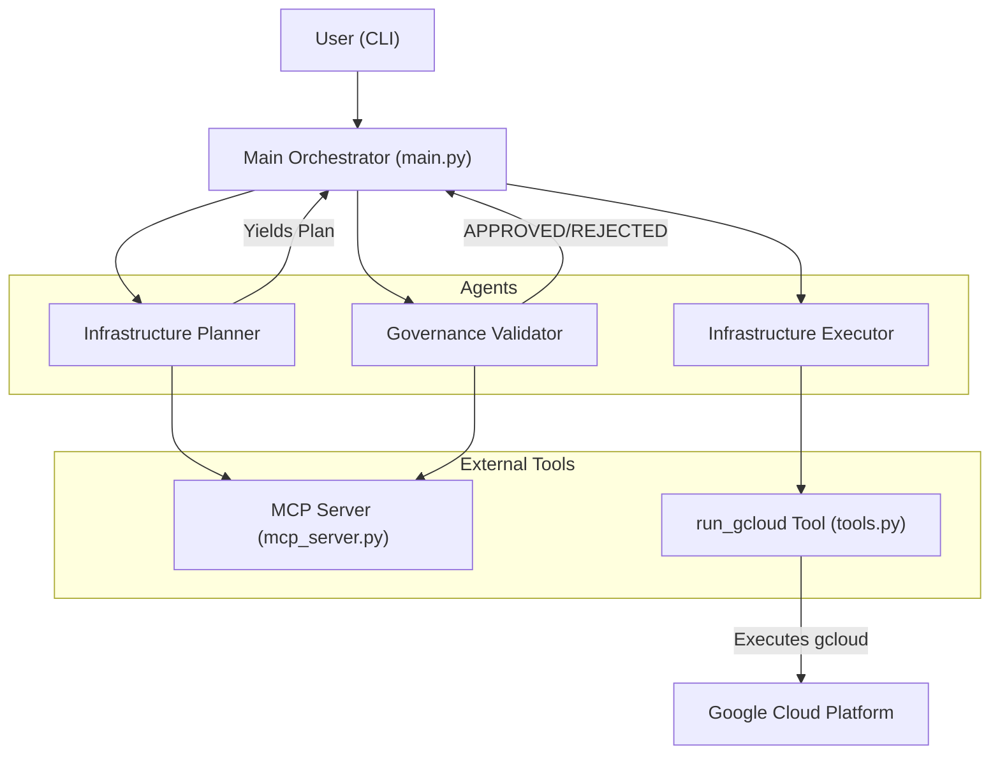
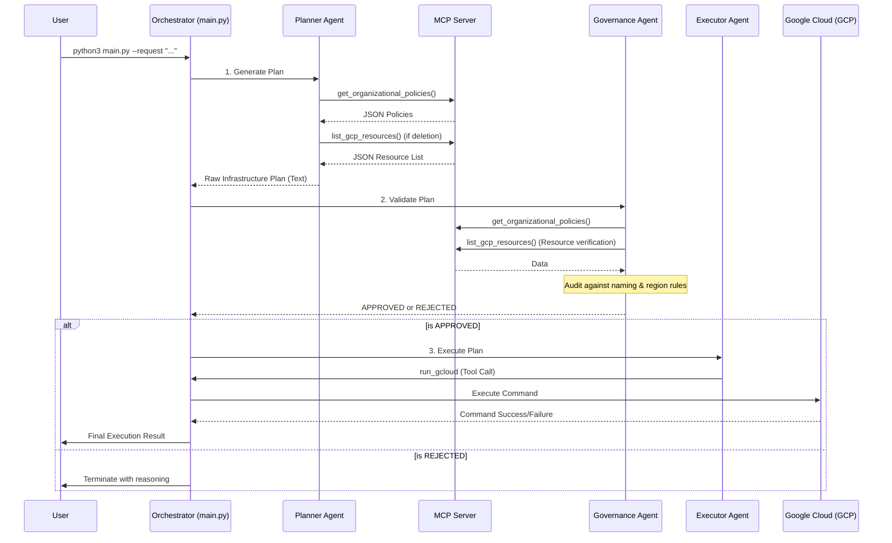

# AI Infrastructure Provisioner Architecture

This document outlines the architecture, data flow, and design decisions for the AI-driven GCP Infrastructure Provisioner.

## High-Level Architecture

The system follows a multi-agent orchestration pattern using the **Google ADK (Agent Development Kit)** and the **Model Context Protocol (MCP)**. It is designed to safely translate natural language into validated GCP infrastructure changes.

## Detailed Request & Data Flow

This sequence diagram illustrates the chronological flow of a provisioning request:

## Agent Communication Flow

The agents do not communicate directly with each other (peer-to-peer). Instead, the **Main Orchestrator** in `main.py` manages the linear state transition:

1.  **Step 1: Planning**: The **Planner** receives the user request. it calls the MCP server to get policies and list existing resources. It outputs a structured text-based infrastructure plan.
2.  **Step 2: Validation**: The Orchestrator passes the *output* of the Planner to the **Governance Agent**. The Governance agent performs a secondary check against policies (via MCP) and either `APPROVES` or `REJECTS` the plan.
3.  **Step 3: Execution**: If approved, the Orchestrator passes the validated plan to the **Executor**. The Executor parses the commands and calls the `run_gcloud` tool to apply changes to GCP.

## Environment Variable Passing

Env variables are managed via a `.env` file and the `python-dotenv` library.

- **Main Orchestrator**: Loads `.env` at startup to configure the `Gemini` models and `GOOGLE_CLOUD_PROJECT`.
- **MCP Server**: Runs as a separate process (via `StdioServerParameters`). It also calls `load_dotenv()` internally to access `GOOGLE_CLOUD_PROJECT`, ensuring that tools like `list_gcp_resources` target the correct project.
- **Tools**: The `run_gcloud` tool inherits the environment of the main process, allowing it to use the authenticated GCP context.

## Why MCP instead of Subagents?

We chose **MCP (Model Context Protocol)** to provide tools to the agents rather than using a hierarchy of subagents for several reasons:

1.  **Context Efficiency**: MCP allows us to provide a set of "standardized tools" (like `get_organizational_policies`) that multiple agents can call independently without needing to pass heavy state between subagents.
2.  **Clear Boundaries**: The MCP server acts as a "Source of Truth" for organizational policies. By keeping this in an MCP server, we ensure that both the Planner and the Governance agent are looking at the *exact same data* without needing to sync their internal states.
3.  **Process Isolation**: The MCP server runs as a separate stdio process. This allows for cleaner separation of concerns; the server handles the "how" (fetching policies/listing resources) while the agents handle the "why" (reasoning and planning).
4.  **Extensibility**: Adding a new capability (e.g., checking cost estimates) only requires adding a tool to the MCP server, which then becomes immediately available to any agent connected to that toolset.

## Security and Guardrails

- **Validated Execution**: Commands are never executed by the model directly. They are passed through a dedicated Governance agent and finally executed by a specialized tool that only allows `gcloud` commands.
- **Resource Verification**: The system uses `list_gcp_resources` before deletion to ensure the agent is not "hallucinating" resource names, preventing accidental deletion of non-existent or unauthorized resources.
